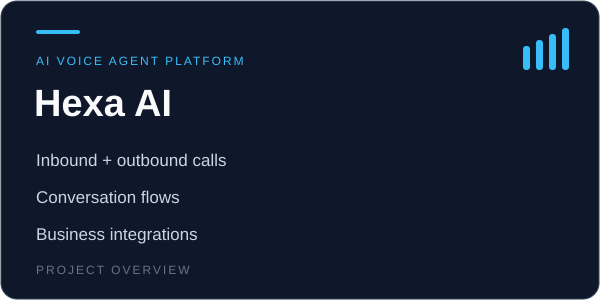
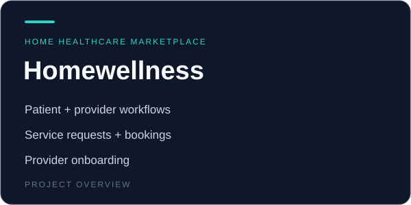

  

  
  
  

  

  <a href="#-featured-projects">Featured projects</a> · <a href="#tech-stack">Tech stack</a> · <a href="#-github-activity">GitHub activity</a>

---

## 👋 About Me

I build web and mobile applications across **enterprise software, healthcare, fintech, and education**. My work spans responsive interfaces, backend services, and native and cross-platform mobile experiences.

- 🌐 **Full-stack:** React, Next.js, TypeScript, Node.js, NestJS, and Hono.
- 📱 **Mobile:** React Native, iOS, Android, Kotlin, and Jetpack Compose.
- ⚡ **Engineering focus:** API design, database performance, reusable components, and third-party integrations.
- 💼 **Software Engineer / Full-Stack Developer at Verdant Soft**, Lahore.

## 🚀 Featured Projects

<table>
<tr>
<td width="33%" valign="top">

<a href="case-studies/hexa-ai.md">Project overview</a> · <a href="https://gethexa.ai/">Visit product</a>

</td>
<td width="33%" valign="top">

<a href="case-studies/homewellness.md">Project overview</a> · <a href="https://app.homewellnessplus.com/">Visit product</a>

</td>
<td width="33%" valign="top">

<a href="case-studies/nedjmati.md">Project overview</a>

</td>
</tr>
</table>

| Project | Description | Tech |
|---------|-------------|------|
| :house_with_garden: **[Homewellness App](case-studies/homewellness.md)** (2026) | Home healthcare marketplace connecting patients and providers, with provider onboarding, service discovery, quotations, appointment booking, and admin workflows | Next.js, React, TypeScript, Hono, Bun, Drizzle ORM, PostgreSQL, Tailwind CSS |
| :telephone_receiver: **[Hexa AI](case-studies/hexa-ai.md)** (2026) | Multi-tenant AI calling platform with inbound/outbound calls, custom conversation flows, and role-based access | NestJS, Next.js, Twilio, OpenAI, ElevenLabs, PostgreSQL |
| :school_satchel: **[Nedjmati App](case-studies/nedjmati.md)** (2026) | Mobile learning app for Grades 1–6 with interactive activities, progress tracking, and a parent dashboard | React Native, Expo, TypeScript, Firebase, Express, Prisma, PostgreSQL |
| :file_folder: **[Case Management Hub](https://app.casemanagementhub.org/)** (2025) | Case management platform for service organizations with customizable forms, client workflows, reporting, scheduling, and role-based access | Next.js, TypeScript, NestJS, PostgreSQL, MongoDB, Firebase, Docker |
| :chart_with_upwards_trend: **[Degn App](https://degn.app/)** (2024–2025) · **Unreleased** | Native Android cryptocurrency trading app with payment integrations, biometric authentication, encrypted wallet storage, and real-time market charts | Kotlin, Android, Jetpack Compose, Firebase, MoonPay, TransFi |
| :golf: **[GOAT App](https://apps.apple.com/us/app/goat-app/id1597319742)** (2024) | Cross-platform reservation app with synchronized tee-time availability, optimized Firebase queries, and a React Native version upgrade | React Native, Firebase, JavaScript |

---

## 🛠️ Tech Stack

**Languages**

  
  
  
  
  
  
  
  
  
  

**Frontend & Mobile**

  
  
  
  
  
  
  
  

**Backend**

  
  
  
  
  
  
  

**Databases**

  
  
  
  
  
  

**DevOps & Tools**

  
  
  
  
  

**AI & Integrations**

  
  
  
  
  
  

---

## 📊 GitHub Activity

My work is spread across two accounts: **[ZeeshiCh](https://github.com/ZeeshiCh)** for my personal profile and **[zeeshanzafarvs](https://github.com/zeeshanzafarvs)** for contributions through one of my office accounts.

  
  

---

## 🐍 Contribution Snake

  <picture>
    <source media="(prefers-color-scheme: dark)" srcset="https://raw.githubusercontent.com/ZeeshiCh/ZeeshiCh/output/github-snake-dark.svg"/>
    <source media="(prefers-color-scheme: light)" srcset="https://raw.githubusercontent.com/ZeeshiCh/ZeeshiCh/output/github-snake.svg"/>
    
  </picture>

---

## 💼 Experience & Education

| Role | Company | Period |
|------|---------|--------|
| **Software Engineer / Full-Stack Developer** | Verdant Soft, Lahore | Jan 2026 – Present |
| **Software Engineer** | TheDesignerX, Lahore | Jul 2022 – Dec 2025 |

<b>Highlights</b>

- **Verdant Soft:** Develop full-stack applications, reusable interfaces, backend services, and third-party integrations; optimize queries, caching, and application performance.
- **TheDesignerX:** Built enterprise workflow features, native Android tools for industrial maintenance and warehouse management, and React Native apps for eCommerce and fundraising; developed serverless services with Node.js and Firebase.

**BS Computer Science** · COMSATS Institute of Information Technology

---

## 🤝 Let’s Connect

Have a web, mobile, or backend project to discuss? Reach me on **[LinkedIn](https://linkedin.com/in/zeeshi-ch)** or at **[Zeeshich019@gmail.com](mailto:Zeeshich019@gmail.com)**.

<i>Thanks for stopping by 👋</i>

