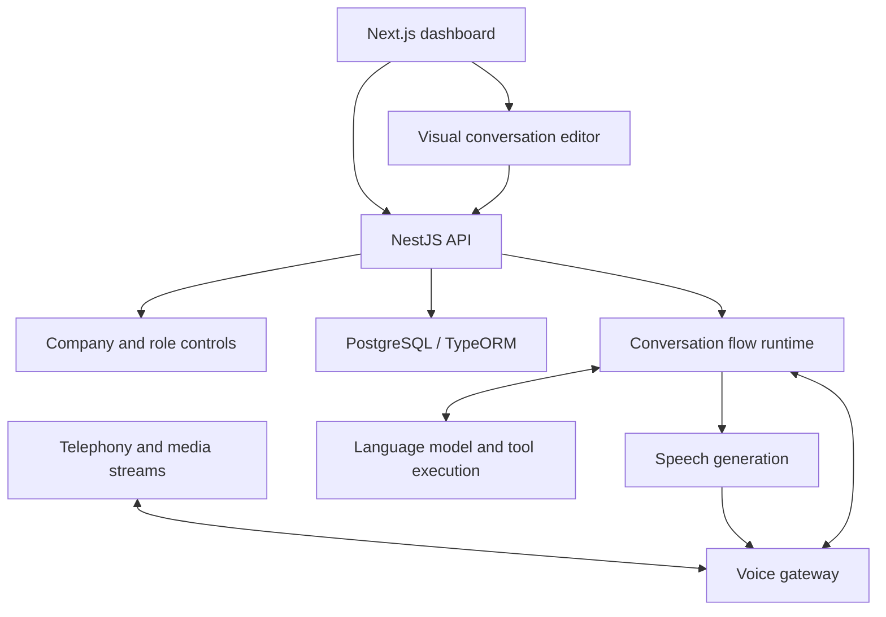

# Hexa AI — Voice Agent Platform

[Visit Hexa AI](https://gethexa.ai/) · [Back to profile](../README.md)

## The Product

Hexa AI helps businesses configure AI agents for inbound and outbound phone conversations. The platform combines company administration, reusable conversation flows, voice configuration, call activity, and messaging workflows.

The engineering challenge is connecting a visual workflow to a live conversation: the system must preserve context, select the next step, handle interruptions, and coordinate external services while administrators configure different businesses independently.

## My Contributions

I contributed across the Next.js dashboard and NestJS backend within a wider engineering team. My development history includes:

- **Conversation-flow integration:** connecting dashboard flows to backend APIs, passing a selected flow into outbound calls, and resolving issues with conversation variables and administrative flow access.
- **Call-transfer configuration:** implementing and refining transfer-node behavior in the editor.
- **Company-specific configuration:** work on company-based clinic flows and unique outbound-number configuration in the dashboard.
- **Messaging interfaces:** WhatsApp media handling and presentation, plus template-related fixes.
- **Supporting product workflows:** contact-form API integration, validation and error messages, email templates, and blog-management features.

These contributions describe my work; the architecture below describes the shared platform.

## Architecture

**Frontend:** Next.js, React, TypeScript, React Flow, Zustand, TanStack Query, Tailwind CSS.  
**Backend:** NestJS, TypeScript, PostgreSQL, TypeORM, WebSockets.  
**Integrations and supporting infrastructure:** Twilio, Telnyx, OpenAI, ElevenLabs, Redis, BullMQ, and S3-compatible storage.

This is a simplified architecture based on the inspected implementation, rather than a deployment topology.

## Technical Challenges & Design Decisions

### Keeping the editor and runtime aligned

The dashboard exposes configurable flows, while the backend interprets nodes, transitions, collected values, and tools. A flow must remain meaningful after it moves from the editor into a live call.

My flow-integration and variable-handling work addressed that boundary. The shared runtime represents conversation state explicitly and renders collected values into responses, allowing a configured workflow to guide subsequent turns.

### Handling live audio and interruptions

Phone conversations are asynchronous. A caller may interrupt generated speech or produce a final transcript after partial speech has already been processed.

The voice gateway includes interruption handling and guards against duplicate media streams. Separating that gateway from the conversation runtime gives transport events and conversation decisions distinct responsibilities. This is a platform design observation, rather than a claim that I implemented the entire voice pipeline.

### Supporting different companies

Company membership and role checks govern configuration and administration. Company-specific flows and outbound-number settings let different businesses use tailored calling workflows through the same product.

My work included those configuration surfaces and flow selection. Company owners, admins, and members have different management capabilities in the backend.

## Results & Evidence

The repository contains concrete implementations for configurable flows, call-transfer nodes, company settings, voice streaming, and messaging interfaces. My history records feature work and fixes across the dashboard and API integration points described above.

No latency benchmark, call-volume figure, or reliability improvement is claimed here: those require production measurements beyond this source review.
