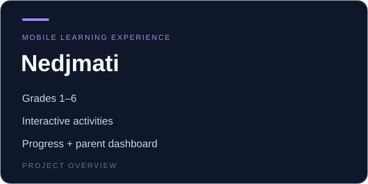

# Nedjmati

A mobile learning application for Grades 1–6 with interactive activities, progress tracking, and a parent dashboard.

The Android app was listed on Google Play; availability varies by region.

## Technology

React Native · Firebase · Node.js · PostgreSQL

## Product scope

- Grades 1–6
- Interactive activities
- Progress + parent dashboard

[Back to profile](../README.md)
