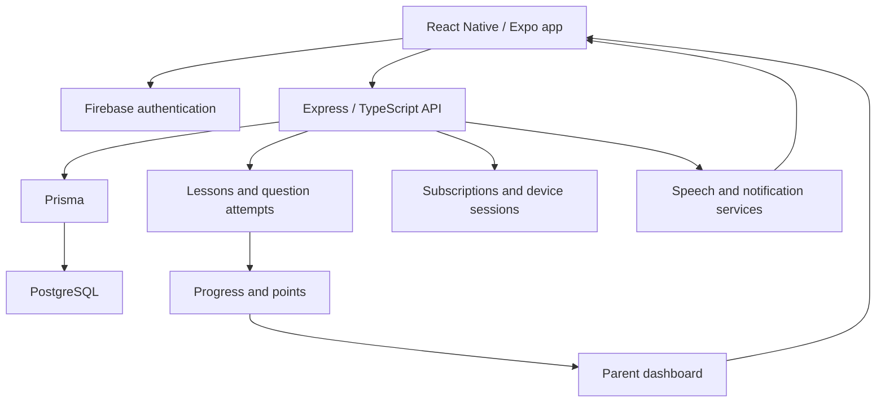

# Nedjmati — Mobile Learning Application

[Back to profile](../README.md)

## The Product

Nedjmati is a mobile learning application for primary-school pupils, with interactive lessons, practice questions, assessments, progress tracking, and parent-facing views.

Its core challenge is maintaining a consistent learning experience across audio, questions, authentication, and navigation, while the backend records each pupil's learning progress separately from the parent account.

The Android app was listed on Google Play. A public store link is not included because regional availability has not been confirmed.

## My Contributions

I worked on the React Native application and its backend within a wider engineering team. My development history includes:

- **Authentication reliability:** Firebase token-refresh handling, authentication fixes, and longer-lived login-session support.
- **Audio and question behavior:** fixes for pause behavior, lesson-introduction audio, and language-aware voice selection.
- **Localization and navigation:** translation work, routing fixes, and opening the appropriate screen from notifications.
- **Device-session management:** implementing device sessions and correcting restrictions, with related backend enforcement work.
- **Learning and parent workflows:** backend changes involving points calculation, parent-dashboard responses, plan translations, and subscription administration.
- **Mobile release maintenance:** Android permission fixes, dependency updates, deep-link configuration, versioning, and Firebase observability integration.

## Architecture

**Mobile:** React Native, Expo, TypeScript, Expo Router, Redux Toolkit, TanStack Query, and React Native Reanimated.  
**Backend:** Node.js, Express, TypeScript, Prisma, and PostgreSQL.  
**Supporting services:** Firebase authentication and observability, push notifications, and Amazon Polly speech generation.

The diagram summarizes application responsibilities rather than every deployment or service connection.

## Technical Challenges & Design Decisions

### Reliable sessions across mobile use

Mobile apps move between foreground, background, interrupted network access, and expired authentication tokens. My authentication work focused on token refresh and login continuity, alongside user feedback for connectivity changes.

The application separates authentication services from feature queries. This provides a shared place to handle credentials while lesson, pupil, and parent views request their own data.

### Coordinating audio, questions, and language

A learning activity combines playback with navigation and user interaction. Pause behavior and language selection must remain consistent when a pupil moves through questions or lesson steps.

My fixes covered question-audio pause behavior, introduction audio, translations, and language-aware voice handling. The backend models lesson steps separately from practice questions and final challenges, allowing different content types to participate in the learning journey.

### Keeping progress meaningful

The backend records individual question attempts and calculates feedback, points, and lesson-level progress. The inspected service accounts for previous attempts rather than relying only on a client-reported score.

My backend work included points-calculation and dashboard changes. Separating attempt history from presentation allows parent views to report learning progress from persisted records.

### Enforcing device limits

Device-session management checks subscription-related limits and records active devices. Registration uses a database transaction and includes eviction behavior when the permitted device count is exceeded.

My development history includes the session implementation and subsequent restriction fixes. This connects subscription rules to actual device usage instead of limiting them to the interface.

## Results & Evidence

The code supports lesson journeys, question attempts, parent views, localization, notifications, and device-session enforcement. My history documents release maintenance and targeted fixes in authentication, audio, translation, and backend behavior.

Firebase analytics, crash reporting, and performance integration provide instrumentation for investigating mobile issues. No adoption, crash-rate reduction, or learning-outcome percentage is claimed without measured evidence.
